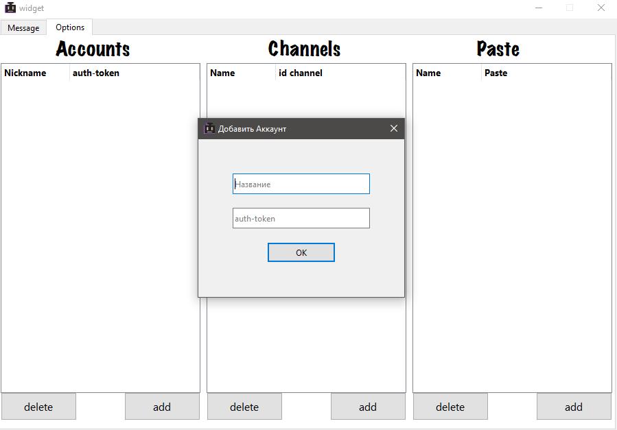
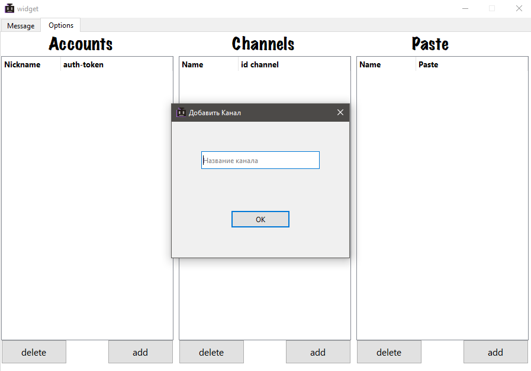
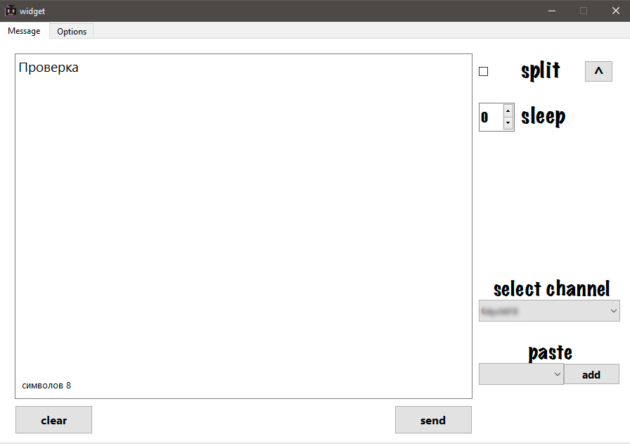

<p align="center"></p>
<h2><p align="center">TwitchBots - отправляй сообщения в чат Twitch с нескольких аккаунтов.</p></h2>

## Функциональность

- Отправка сообщений в чат Twitch с различных аккаунтов.
- Поддержка авторизации через Auth-token для нескольких учетных записей.
- Сохранения паст для последующих использований.
- Удобный пользовательский интерфейс

### Установка

1. Клонируйте репозиторий:

   ```bash
   git clone https://github.com/feed619/TwitchBots.git
   ```

2. Скачать вручную через zip.

### Запуск приложения:

- Откройте в папке TwitchBots файл `TwitchBots.exe`
- Запуститься два окна, окно Python, необходимо скрыть во исзбежаниии случайного закрытии приложения.

### Использование

## Открываем вкладку "Options"

- В таблице "Accounts" добавьте аккаунт, используя auth-token. Для этого нажмите кнопку "add", укажите имя бота и вставьте auth-token.
<p align="center"></p>
- В таблице "Channels" добавьте название канала, на который будут отправляться сообщения. Для этого используйте кнопку "add" и введите название канала.
<p align="center"></p>

## Во вкладке "Message"

1. Введите сообщение в текстовое поле.
2. Выберите канал из списка доступных каналов "select channel".
3. Нажмите кнопку "send" для отправки сообщения.
<p align="center"></p>

## Дополнительные функции:

- "split": Активируйте эту опцию, чтобы разбивать сообщение по символу '^'. Это позволит отправлять различные сообщения каждому боту.
- "sleep" - время задержки между сообщениями.
- "paste" - выберите пасту и нажмите кнопку "add", после чего паста добавится в поле для сообщения.
- "clear" - очищает поле для сообщения

### Лицензия

Этот проект лицензирован под лицензией MIT. Подробности см. в файле `LICENSE`.

### Обратная связь:

Всегда рад услышать ваши отзывы и предложения по улучшению проекта. Пожалуйста, оставьте свой отзыв.

- [Email](mailto:feed619pro@gmail.com)
